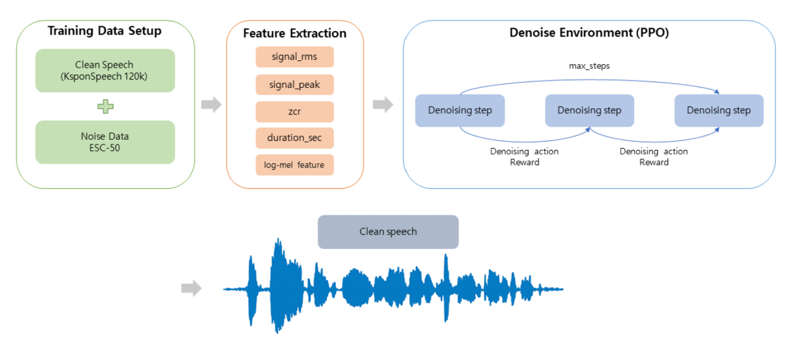

# HEAR : Hybrid audio restoration Enhancement with Adaptive Reinforcement

Reinforcement Learning을 사용한 오디오 노이즈 제거 프로젝트입니다. PPO, SAC, TD3 알고리즘을 사용하여 최적의 denoising 방법과 파라미터를 학습합니다.

**Authors:** 20231837 김상부 / 20231846 송지아

## 📊 프로젝트 개요



## 📁 프로젝트 구조

```
RL_prj_release/
├── Dockerfile                  # Docker 환경 설정
├── inference.py                # 학습된 모델로 추론
├── run_experiments.py          # 실험 실행 스크립트
├── rl/                         # RL 관련 모듈
│   ├── __init__.py
│   ├── train_agent.py          # RL 에이전트 학습
│   ├── custom_algorithms.py    # PPO/SAC/TD3 구현
│   ├── env.py                  # Denoising 환경 정의
│   └── dataset.py              # 데이터셋 로딩
├── utils/                      # 유틸리티 모듈
│   ├── __init__.py
│   ├── extract_features.py    # 오디오 특징 추출
│   └── denoise_metrics.py      # Denoising 성능 평가
├── train_data/                 # 학습 데이터
│   ├── clean/                  # Clean 오디오 파일
│   ├── noisy/                  # Noisy 오디오 파일
│   ├── meta.csv                # 메타데이터
│   └── train_state_features.csv # 추출된 특징 데이터
├── runs/                       # 학습 결과 저장
│   └── rl_train/              # 기본 학습 결과
└── weight/                     # 모델 가중치 (선택)
```

## 🚀 빠른 시작

### 1. Docker 환경 설정

```bash
# Docker 이미지 빌드
cd /home/sangbu/RL_prj_release
docker build -t rl-audio-env .

# 컨테이너 실행 (GPU 사용)
docker run -it --gpus all \
  -v /home/sangbu/RL_prj_release:/workspace \
  rl-audio-env

# 컨테이너 내부에서 작업 디렉토리로 이동
cd /workspace
```

### 2. 데이터 준비

프로젝트는 다음 데이터 구조를 기대합니다:

```
train_data/
├── clean/                    # Clean 오디오 파일 (.wav)
├── noisy/                    # Noisy 오디오 파일 (.wav)
├── meta.csv                 # 메타데이터 (utt_id, clean_path, noisy_path, snr_db 등)
└── train_state_features.csv # 학습용 특징 데이터 (생성됨)
```

**중요:** `meta.csv`의 `clean_path`와 `noisy_path`는 `train_data/clean/` 및 `train_data/noisy/`를 기준으로 한 상대 경로여야 합니다.

## 📝 주요 스크립트 사용법

### 1. RL 에이전트 학습 (Training)

PPO, SAC, TD3 알고리즘으로 denoising 에이전트를 학습합니다.

```bash
# 방법 1: 모듈로 실행 (권장)
python -m rl.train_agent \
    --algo ppo \
    --features train_data/train_state_features.csv \
    --total-steps 50000 \
    --max-steps 3 \
    --reward-scale 4.0 \
    --stoi-weight 10.0 \
    --estoi-weight 10.0 \
    --diversity-weight 0.1 \
    --device cuda \
    --wandb-project rl-denoise

# 방법 2: PYTHONPATH 설정
PYTHONPATH=/workspace python rl/train_agent.py \
    --algo ppo \
    --features train_data/train_state_features.csv \
    --total-steps 50000 \
    --max-steps 3 \
    --reward-scale 4.0 \
    --stoi-weight 10.0 \
    --estoi-weight 10.0 \
    --diversity-weight 0.1 \
    --device cuda \
    --wandb-project rl-denoise
```

**주요 옵션:**
- `--algo`: 알고리즘 선택 (`ppo`, `sac`, `td3`, 기본: `ppo`)
- `--features`: 특징 CSV 파일 경로 (기본: `train_data/train_state_features.csv`)
- `--total-steps`: 총 학습 스텝 수 (기본: 200000)
- `--max-steps`: 에피소드당 최대 denoising 스텝 (기본: 3)
- `--reward-scale`: 보상 스케일 (기본: 5.0)
- `--stoi-weight`, `--estoi-weight`: STOI/ESTOI 가중치 (기본: 0.0)
- `--diversity-weight`: 방법 다양성 가중치 (기본: 0.0)
- `--device`: 사용할 디바이스 (`cuda` 또는 `cpu`, 기본: 자동 감지)
- `--wandb-project`: Weights & Biases 프로젝트 이름 (기본: None)
- `--log-dir`: 로그 및 체크포인트 저장 디렉토리 (기본: `runs/rl_train`)

**PPO 특화 옵션:**
- `--clip-range`: PPO 클리핑 범위 (기본: 0.2)
- `--entropy-coef`: 엔트로피 계수 (기본: 0.0)
- `--rollout-steps`: 롤아웃 버퍼 크기 (기본: 2048)
- `--update-epochs`: 업데이트 에포크 수 (기본: 10)
- `--batch-size`: 배치 크기 (기본: 256)
- `--actor-lr`, `--critic-lr`: Actor/Critic 학습률 (기본: 3e-4)

**SAC/TD3 특화 옵션:**
- `--random-steps`: 랜덤 액션 스텝 수 (기본: 2000)
- `--warmup-steps`: 워밍업 스텝 수 (기본: 4000)
- `--tau`: 타겟 네트워크 업데이트 계수 (기본: 0.005)

### 2. 실험 실행 (Experiment Runner)

여러 하이퍼파라미터 조합으로 실험을 순차적으로 실행합니다.

```bash
python run_experiments.py \
    --config experiments.json \
    --features train_data/train_state_features.csv \
    --device cuda \
    --wandb-project rl-denoise
```

**실험 설정 파일 예시 (`experiments.json`):**
```json
{
  "experiments": [
    {
      "name": "ppo_baseline",
      "algo": "ppo",
      "base_args": {
        "features": "train_data/train_state_features.csv",
        "total_steps": 50000,
        "max_steps": 3,
        "reward_scale": 4.0
      },
      "sweep_params": {
        "stoi_weight": [10.0, 20.0, 40.0],
        "diversity_weight": [0.1, 0.2]
      }
    }
  ]
}
```

**주요 옵션:**
- `--config`: 실험 설정 JSON 파일 경로
- `--features`: 특징 CSV 파일 경로
- `--device`: 사용할 디바이스
- `--wandb-project`: Weights & Biases 프로젝트 이름
- `--output-root`: 결과 저장 루트 디렉토리 (기본: `runs/experiments`)

### 3. 추론 (Inference)

학습된 모델로 noisy 오디오를 denoising합니다.

```bash
# 단일 모델 추론
python inference.py \
    --checkpoint runs/rl_train/model.pt \
    --input train_data/noisy/sample.wav \
    --output denoised_output.wav

# Clean reference와 함께 메트릭 계산
python inference.py \
    --checkpoint runs/rl_train/model.pt \
    --input train_data/noisy/sample.wav \
    --clean train_data/clean/sample.wav \
    --output denoised_output.wav

# 여러 모델 비교
python inference.py \
    --checkpoint runs/rl_train/model.pt \
    --checkpoint runs/experiments/ppo_baseline/00_1234567890/model.pt \
    --checkpoint runs/experiments/ppo_v2/00_1234567891/model.pt \
    --input train_data/noisy/sample.wav \
    --output denoised_output.wav
```

**주요 옵션:**
- `--checkpoint`: 학습된 모델 체크포인트 경로 (필수, 여러 개 지정 가능)
- `--input`: 입력 noisy 오디오 파일 경로 (필수)
- `--output`: 출력 denoised 오디오 파일 경로 (필수)
- `--train-features`: 학습 시 사용한 특징 CSV (scaler용, 기본: `train_data/train_state_features.csv`)
- `--clean`: (선택) Clean reference 파일 (메트릭 계산용)
- `--max-steps`: Denoising 스텝 수 (기본: 체크포인트에 저장된 값 사용)
- `--device`: 사용할 디바이스 (`cuda` 또는 `cpu`, 기본: 자동 감지)
- `--target-sr`: 타겟 샘플레이트 (기본: 16000)
- `--n-mels`: Mel 스펙트로그램 밴드 수 (기본: 64)
- `--n-fft`: FFT 크기 (기본: 1024)
- `--hop-length`: Hop length (기본: 256)

**출력:**
- Denoised 오디오 파일 (.wav)
- 여러 체크포인트 사용 시: `denoised_output__{tag}.wav` 형식으로 저장
- Clean reference가 제공되면 SI-SDR, STOI, ESTOI 메트릭 출력

## 🔧 유틸리티 (Utils)

### 1. 특징 추출 (Feature Extraction)

오디오 파일에서 RL 상태 입력용 특징을 추출합니다.

```bash
python utils/extract_features.py \
    --meta-path train_data/meta.csv \
    --output-path train_data/train_state_features.csv \
    --target-sr 16000 \
    --n-mels 64 \
    --n-fft 1024 \
    --hop-length 256
```

**중요:** `meta.csv` 파일은 다음 구조를 가져야 합니다:
- `utt_id`: 발화 ID
- `clean_path`: Clean 오디오 파일 경로 (상대 경로)
- `noisy_path`: Noisy 오디오 파일 경로 (상대 경로)
- `clean_source`: Clean 오디오 소스 정보
- `noise_source`: 노이즈 소스 정보
- `snr_db`: SNR 값 (dB)
- `duration_sec`: 오디오 길이 (초)

**주요 옵션:**
- `--meta-path`: 메타데이터 CSV 파일 경로 (기본: `train_data/meta.csv`)
- `--output-path`: 출력 특징 CSV 파일 경로 (기본: `train_data/train_state_features.csv`)
- `--target-sr`: 타겟 샘플레이트 (기본: 16000)
- `--n-mels`: Mel 스펙트로그램 밴드 수 (기본: 64)
- `--n-fft`: FFT 크기 (기본: 1024)
- `--hop-length`: Hop length (기본: 256)
- `--limit`: 처리할 파일 수 제한 (기본: 전체)

### 2. 성능 평가 (Metrics Evaluation)

Denoising 전후의 메트릭을 비교합니다.

```bash
python utils/denoise_metrics.py \
    --checkpoint runs/rl_train/model.pt \
    --meta train_data/meta.csv \
    --train-features train_data/train_state_features.csv \
    --sample-size 100 \
    --snr-db 0 --snr-db 5 --snr-db 10 \
    --csv results.csv \
    --plot-dir plots
```

**주요 옵션:**
- `--checkpoint`: 평가할 모델 체크포인트 (여러 개 가능)
- `--meta`: 메타데이터 CSV (기본: `train_data/meta.csv`)
- `--train-features`: 학습 시 사용한 특징 CSV (기본: `train_data/train_state_features.csv`)
- `--sample-size`: 평가할 샘플 수 (0 = 전체, 기본: 100)
- `--snr-db`: 평가할 SNR 값들 (여러 개 지정 가능)
- `--seed`: 샘플링 시드 (기본: 0)
- `--csv`: 결과 CSV 저장 경로
- `--plot-dir`: 플롯 저장 디렉토리
- `--output-dir`: Denoised 오디오 저장 디렉토리

**출력:**
- 메트릭 CSV 파일 (SI-SDR, STOI, ESTOI)
- 플롯 이미지 (지정 시)
- Denoised 오디오 파일 (지정 시)

## 💡 전체 워크플로우

```bash
# 1. 특징 추출
python utils/extract_features.py \
    --meta-path train_data/meta.csv \
    --output-path train_data/train_state_features.csv

# 2. 모델 학습
python -m rl.train_agent \
    --algo ppo \
    --features train_data/train_state_features.csv \
    --total-steps 50000 \
    --max-steps 3 \
    --reward-scale 4.0 \
    --stoi-weight 10.0 \
    --estoi-weight 10.0 \
    --diversity-weight 0.1 \
    --device cuda

# 3. 추론
python inference.py \
    --checkpoint runs/rl_train/model.pt \
    --input train_data/noisy/test_sample.wav \
    --output test_denoised.wav

# 4. 성능 평가
python utils/denoise_metrics.py \
    --checkpoint runs/rl_train/model.pt \
    --meta train_data/meta.csv \
    --train-features train_data/train_state_features.csv \
    --sample-size 100
```

## 🎵 오디오 예시

다음은 denoising 전후의 오디오 샘플입니다:

### Sample 1
- **Clean (원본)**
  <audio controls src="data_sample/clean_1.wav"></audio>
  [다운로드](data_sample/clean_1.wav)

- **Noisy (노이즈 포함)**
  <audio controls src="data_sample/noisy_1.wav"></audio>
  [다운로드](data_sample/noisy_1.wav)

- **Denoised (처리 후)**
  <audio controls src="data_sample/denoise_1.wav"></audio>
  [다운로드](data_sample/denoise_1.wav)

### Sample 2
- **Clean (원본)**
  <audio controls src="data_sample/clean_2.wav"></audio>
  [다운로드](data_sample/clean_2.wav)

- **Noisy (노이즈 포함)**
  <audio controls src="data_sample/noisy_2.wav"></audio>
  [다운로드](data_sample/noisy_2.wav)

- **Denoised (처리 후)**
  <audio controls src="data_sample/denoise_2.wav"></audio>
  [다운로드](data_sample/denoise_2.wav)
